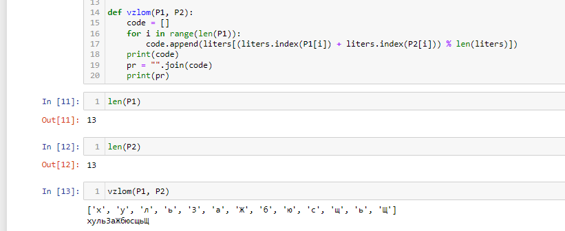

---
## Front matter
lang: ru-RU
title: Шифр гаммирования
author: Федюшина Ярослава Андреевна
institute: Российский Университет Дружбы Народов
date: 3 октября, 2024, Москва, Россия

## Formatting
mainfont: PT Serif
romanfont: PT Serif
sansfont: PT Sans
monofont: PT Mono
toc: false
slide_level: 2
theme: metropolis
header-includes: 
 - \metroset{progressbar=frametitle,sectionpage=progressbar,numbering=fraction}
 - '\makeatletter'
 - '\beamer@ignorenonframefalse'
 - '\makeatother'
aspectratio: 43
section-titles: true

---

# Цели и задачи

## Цель лабораторной работы

Освоить на практике применение режима однократного гаммирования на примере кодирования различных исходных текстов одним ключом.

# Выполнение лабораторной работы

## Гаммирование

Гаммирование – это наложение (снятие) на открытые (зашифрованные) данные криптографической гаммы, т.е. последовательности элементов данных, вырабатываемых с помощью некоторого криптографического алгоритма, для получения зашифрованных (открытых) данных.

## Алгоритм взлома

Шифротексты обеих телеграмм можно получить по формулам режима однократного гаммирования:

$$C_1 = P_1 \oplus K$$
$$C_2 = P_2 \oplus K$$

## Алгоритм взлома

Открытый текст можно найти, зная шифротекст двух телеграмм, зашифрованных одним ключом. Для это оба равенства складываются по модулю 2. Тогда с учётом свойства операции XOR получаем:

$$C_1 \oplus C_2 = P_1 \oplus  K \oplus  P_2 \oplus  K = P_1 \oplus P_2$$

## Алгоритм взлома

Предположим, что одна из телеграмм является шаблоном — т.е. имеет текст фиксированный формат, в который вписываются значения полей.
Допустим, что злоумышленнику этот формат известен. 
Тогда он получает достаточно много пар $C_1 \oplus C_2$ (известен вид обеих шифровок).
Тогда зная $P_1$ имеем:

$$C_1 \oplus C_2 \oplus P_1 = P_1 \oplus P_2 \oplus P_1 = P_2$$ 

## Схема работы алгоритма

{ #fig:001 }

## Пример работы программы

{ #fig:002 }

{ #fig:003 }

# Выводы

## Результаты выполнения лабораторной работы

В ходе выполнения лабораторной работы было разработано приложение, позволяющее шифровать тексты в режиме однократного гаммирования.